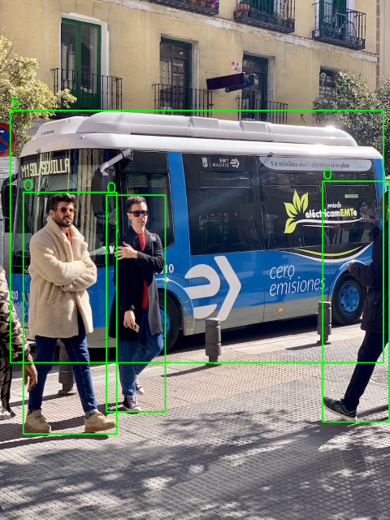

# Yolov8 TensorRT

Deploy the [YOLOV8](https://github.com/ultralytics/ultralytics) model for object detection using OpenCV and [TensorRT](https://github.com/NVIDIA/TensorRT).

## Overview




## Dependencies

- CMAKE
- Microsoft Visual Studio
- CUDA: Only [download](https://github.com/xiaohaoo/Yolo_TensorRT/releases/download/v1.0.0/lib.zip) the required runtime library.
- OpenCV: Only [download](https://github.com/xiaohaoo/Yolo_TensorRT/releases/download/v1.0.0/lib.zip) the required runtime library.

## Installation

```bash
git clone git@github.com:xiaohaoo/Yolo_TensorRT.git

cd Yolo_TensorRT
cmake -DCMAKE_BUILD_TYPE:STRING=Release -B build -G "Visual Studio 16 2019"
cmake --build build --config Release --target install

# run app
cd build\output
.\yolo.exe
```
